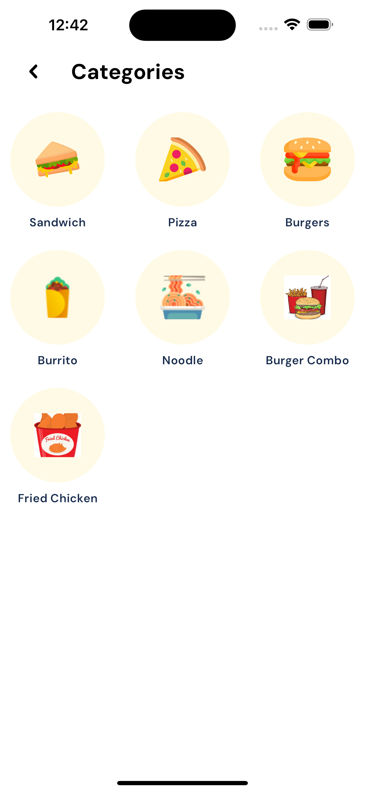
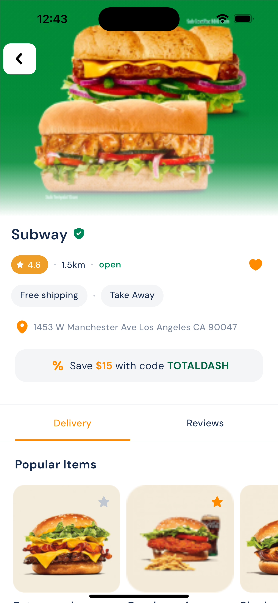
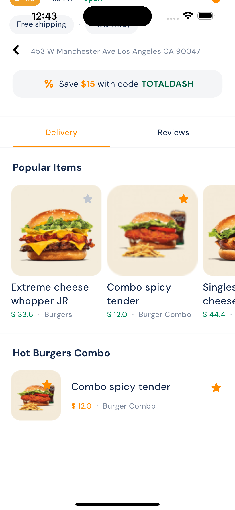
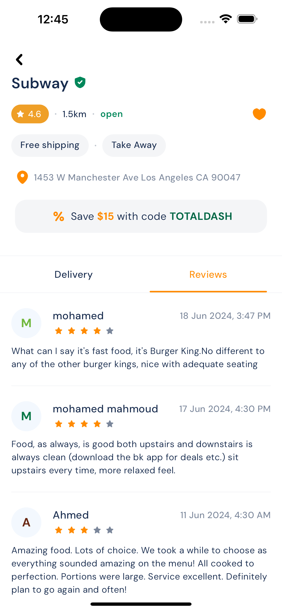

# Food and Restaurants Flutter App

This Flutter application is designed to provide users with a convenient way to explore various foods and restaurants. It allows users to browse through a wide range of food options, view detailed information about restaurants, and discover new culinary experiences.

## Features

- Browse Foods: Users can explore a diverse selection of foods, including different cuisines, dishes, and ingredients. They can view images, descriptions, and nutritional information for each food item.

- Search Functionality: The app provides a powerful search feature that enables users to search for specific foods or restaurants based on keywords, cuisines, or dietary preferences.

- Restaurant Listings: Users can access a curated list of restaurants, along with essential details such as location, opening hours, menu options, and customer reviews.

- User Reviews and Ratings: The app allows users to share their experiences by leaving reviews and ratings for restaurants they have visited. This feature enables others to make informed decisions about where to dine.

- User Profiles: Users can create personalized profiles within the app, enabling them to save favorite foods, bookmark restaurants, and track their dining history.

 
  
